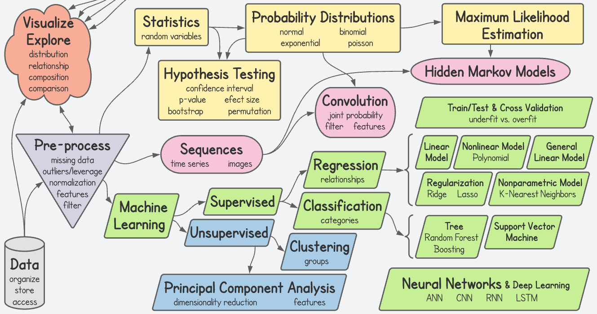

# NEU-365P-385L-Spring-2022
Programming and Data Analysis for Modern Neuroscience, Spring 2022

---

- [Objective](#objective)
- [Breadth over Depth](#breadth-over-depth)
- [Prerequisites](#prerequisites)
- [Requirements](#requirements)
- [Academic Integrity](#academic-integrity)
- [Inclusion](#inclusion)
- [Course Details](#course-details)
- [Contact](#contact)
- [Office Hours](#office-hours)
- [Discussion Board](#discussion-board)
- [Policies](#policies)
- [Grades](#grades)
- [Grading Rubric](#grading-rubric)
- [Homework](#homework-pencil2)
- [Homework Collaboration](#homework-collaboration)
- [Topics Map](#topics-map)
- [Syllabus](#syllabus)
- [Install Python and JupyterLab (required)](#install-python-and-jupyterlab-required) :bangbang: Install Python 3.x, Conda and JupyterLab PRIOR TO THE FIRST CLASS.
- [Resources](#resources)
- [Interesting Python packages](#interesting-python-packages)

---

## Objective

*The ability to read and write are obvious fundamental skills critical to all academic and quantitative pursuits.* **Fast approaching this level of fundamental importance is the ability to write computer programs to analyze and manipulate data sets ever increasing in richness and size.** This skillset is necessary to work with a wide array of systems whose models and behavior are sufficiently complex to make analysis by hand intractable.

**In this course you will translate problems into code applying modern approaches for data analysis, statistical inference and modeling to various levels of neural systems and their component behavior.** We will use Python as a coding environment, and you will be exposed to resources and options for scientific computing.

 *Although geared for neuroscience, the approaches covered in this course are highly salient for a wide array of applications.*

 ## Breadth over Depth

We will cover a wide array of topics rather than explore any one topic in great detail. Topics will be introduced at a level where you should be able to understand each concept and put them to use. However, realize up front that we may have only scratched the surface.

*The goal of the course is to give you enough of a basic toolset that you will have the necessary foundation to develop programs for any concept that you understand.*

## Prerequisites

There are no prerequisites for the course. *However, you are expected to be familiar with basic mathematical functions and concepts, and you will be asked to perform quantitative calculations and to think critically.* **This is NOT an easy course.**

## Requirements

You must `bring a laptop to class` for hands on participation. If you do not own a laptop, contact your department or the College of Natural Sciences to obtain a loaner for the duration of the course. Install Python 3.x, Conda and JupyterLab PRIOR TO THE FIRST CLASS. See the installation instructions near the end of this document.

Other than that you should be motivated, prepared to work hard, respectful and help to foster an inclusive environment.

Finally, I want you to have fun and learn a lot!

## Academic Integrity

It is perfectly fine to work with your fellow students or anyone else on the homework assignments. If you do so, please include a note on your assignment indicating with whom you collaborated (`see Homework Collaboration below`). Any academic dishonesty such as copying a fellow students assignment without collaborating in its completion will be severly punished as outlined by the University. **Most importantly, the ability to solve problems such as those in the homeworks is exactly the skillset you are here to obtain.** By not practicing these skills, you are primarily hurting yourself.

## Inclusion

Along with the entire Department of Neuroscience, this course embraces a notion of an intellectual community enriched and enhanced by diversity along a number of dimensions, including race, ethnicity and national origins, gender and gender identity, sexuality, class, ability level, and religion. We are especially committed to fostering an environment where you feel heard and respected in your courses.

## Course Details

* Time: TTH 2:00-3:30 PM
* Location: BUR 208
* Instructor: Marcel Goldschen-Ohm
* TA: Ashray Saxena

## Contact

Please contact myself or the TA via `Canvas`.

## Office Hours

Office hours are `Zoom only`. See `Canvas` announcement for times and Zoom links.

### I'm confused, but my schedule makes attending office hours difficult. What do I do?

Post your questions on the `Discussion Board` (see below) where either myself or your fellow students can help. I may not reply immediately as advice from fellow students can often be the most illuminating.

## Discussion Board

See Canvas for a link to the discussion board.

:bangbang: Every time you interact with the discussion board in a meaningful way, you will receive `one point of extra credit`. Myself and the TA will decide what constitutes 'meaningful'. I realize this is subjective, but in general it includes asking a question, answering a question, or contributing addtional information or resources relevant to the course. Also, do not purposely attempt to break up your responses into many tiny chunks. All responses regarding a particular topic will together be considered as a single interaction. This extra credit will be tabulated weekly and points added within Canvas.

## Policies

Students with disabilities may request appropriate academic accommodations from the Division of Diversity and Community Engagement, [Services for Students with Disabilities](http://www.utexas.edu/diversity/ddce/ssd/) (471-6259).

## Grades

:bangbang: Homework constitutes the majority of your grade, so it is imperitive that you complete the homework on time in order to do well in this course.

    A: 90-100%
    B: 80-89%
    C: 70-79%
    D: 60-69%
    F: <60%

Depending on the distribution of scores, I may alter the above ranges to normalize to the difficulty of the assignments. If I do so, `any alteration will only be favorable to you` and never unfavorable. Note that in the case that I do change the ranges, I will NOT apply a curve to the letter grades. `I am very happy to give everyone an A if possible.`

## Grading Rubric

Most questions will be worth 3 points for which the grading rubric is:

    +1 point for a remotely valid attempt
    +2 points if there are only minor mistakes
    +3 points if appropriately addressed

## Homework :pencil2:

Most homework will be in the form of Jupyter notebooks.

Homework assignments will be posted on `Canvas` where you will be required to upload the completed notebook file. Be sure to include your full name in the filename of each of your assignments (e.g. `assignment-your_full_name.ipynb`).

Homework is predominantly weekly, and you will usually have one week to complete the assignment. All homework is `due by midnight on the due date`. Note that uploading to Canvas can sometimes be less than instantaneous, so `don't wait until one minute before midnight to submit`. Late homework is not acceptable.

:bangbang: The course is fast paced, so keeping up with practicing the nearly weekly homework is critical for your success.

:warning: If you clone this repository, be sure to `move the homework files outside of your cloned folder` before you work on them. Otherwise, the next time you sync with this repository `your homework will be overwritten with blank assignments`! You don't have to worry about this if you download the files manually.

:warning: I reserve the right to alter any of the homework files anytime prior to their assignment. If you opt to complete any of the assignments ahead of time, it is up to you to check for any changes at the time of assignment.

## How to manually download Jupyter notebook homework files

1. Navigate to the `*.ipynb` Jupyter notebook file in this repository.
2. Right-click on the `Raw` button above the file preview and `download` the file.
3. In JupyterLab, navigate to the file and open it.

:warning: In the past some people experienced that their downloads were treated as text files with an extension of `.ipynb.txt`. If this happens you will not be able to open the file in JupyterLab until you `remove the .txt` extension so that the file has the proper extension of `.ipynb`.

## Homework Collaboration

You are `allowed to collaborate` with your classmates on homework assignments unless otherwise indicated. If you do so, you `must include the names of everyone you collaborated with` at the very beginning of the assignment. For Jupyter notebooks, please `insert a new first Markdown cell` with all `collaborators names in a bulleted list` like this:

* collaborater 1
* collaborator 2

:bangbang: It is imperitive that both collaborators have each others names in their respective lists. Any academic dishonesty such as copying a fellow students assignment without collaborating in its completion will be severly punished as outlined by the University.

## Topics Map

## Syllabus

:warning: The syllabus is unlikely to change much, but I reserve the right to tweak and change it as we go along, so check back often. This is so I can offer you a more polished experience by adjusting to your performance and feedback throughout the course. Note that this also includes homework assignments (see Homework above).

:cyclone: = Learning Objectives

:pencil2: = Homework

:paperclip: = Additional Resources (please share if you know of a good resource not listed)

---
* Jan-18-T: Introduction to the Python and Jupyter ecosystem
    * :cyclone: You will understand compiled vs. interpreted code.
    * :cyclone: You will have a general understanding of the Python ecosystem.
    * :cyclone: You will be introduced to the Conda package manager.
    * :cyclone: You will be introduced to the JupyterLab environement.
    * :bangbang: Install [Python and Conda](https://docs.conda.io/en/latest/miniconda.html) (see instructions at bottom of page)
    * `conda install -c conda-forge jupyterlab`
    * `jupyter-lab` <-- launches JupyterLab in your web browser
    * :paperclip: [What can I do with Python?](https://realpython.com/what-can-i-do-with-python/), [Miniconda](https://docs.conda.io/en/latest/miniconda.html), [Intro to Jupyter and JupyterLab](https://coderefinery.github.io/jupyter/)
* Jan-20-R: Python basics
    * :cyclone: You will be able to work with variables.
    * :cyclone: You will be able to create, index into, slice, and iterate over lists.
    * :cyclone: You will understand how Python code is organized into blocks.
    * :cyclone: You will be able to conditionally execute code blocks.
    * :cyclone: You will understand the difference between a copy and a reference.
    * :pencil2: Python basics :alarm_clock: due Jan-24-M
    * :paperclip: [Python lists](https://developers.google.com/edu/python/lists), [List exercises](https://holypython.com/beginner-python-exercises/exercise-6-python-lists/), [List slicing exercises](https://holypython.com/beginner-python-exercises/exercise-17-python-slicing/), [Python beginner tutorials](https://www.tutorialsteacher.com/python), [Python basics](https://www.learnpython.org), [The Hitchhiker's Guide to Python](https://docs.python-guide.org/intro/learning/), [More Python tutorials](https://wiki.python.org/moin/BeginnersGuide/NonProgrammers), [Python Tutor](https://pythontutor.com)
---
* Jan-25-T: NumPy multi-dimensional data arrays and basic plotting
    * :cyclone: You will have an idea of why data are often represented as multi-dimensional arrays.
    * :cyclone: You will be able to use NumPy to index, slice, manipulate and get statistics for data arrays.
    * :cyclone: You will gain some appreciation for why NumPy is an absolute necessity for data science.
    * :cyclone: You will be able to create basic plots with Matplotlib.
    * :cyclone: You will be able to create interactive plots with Plotly.
    * `conda install numpy`
    * `conda install matplotlib`
    * `conda install -c plotly plotly`
    * `conda install ipywidgets` --> reboot jupyter-lab afterwards
    * :paperclip: [NumPy](https://numpy.org), :star:[A visual intro to NumPy](https://jalammar.github.io/visual-numpy/), [Matplotlib](https://matplotlib.org), [Plotly](https://plotly.com/python/getting-started/)
* Jan-27-R: Random walk lab
    * :cyclone: You will apply everything you have learned up to this point (basic Python, NumPy, plotting) to simulate random walks.
    * :cyclone: You will appreciate the role of randomness in molecular diffusion.
    * :bangbang: These simulations are a great way for you to practice Python basics, leveraging the power of NumPy multi-dimensional data arrays, and plotting your results in the context of a simulation that is informative on an important physical phenomenon salient to neural signaling. **I cannot stress enough the importance of this assignment to establish the fundamentals we will use throughout this course. Make sure you are able to complete this assignment with full understanding of your code.**
    * :bangbang: I realize that for those of you with little to no prior coding experience, this assignment may be a big leap. If you find yourself struggling, I want you to realize that this is not necessarily unexpected, and I want you to use all available resources to reach out for help including the course discussion board, office hours, group study sessions, online resources, etc. As a last resort, please reach out directly to either myself or the TA. **This assignment is that important.**
    * :pencil2: Random walks :alarm_clock: due Feb-04-F
    * :paperclip: [Diffusion and random walks](https://www.uio.no/studier/emner/matnat/fys/FYS2160/h17/simuleringsopgaver/virrevandrer_diffusjon.pdf)
---
* Feb-01-T: Functions, classes, modules and optimization with Numba
    * :cyclone: You will be able to write your own Python functions.
    * :cyclone: You will understand the basics of Python class objects.
    * :cyclone: You will be able to create your own Python modules.
    * :cyclone: You will be able to use Numba to accelerate your functions.
    * `conda install numba`
    * :paperclip: [Numba](http://numba.pydata.org)
* Feb-03-R: Basics Lab & Quiz
    * :bangbang: **No homework this week.** If you find yourself behind, **this is the time to catch up**.
---
* Feb-08-T: Probability distributions of random variables and the Central Limit Theorem
    * :cyclone: You will understand the difference between a probability and a probability density.
    * :cyclone: You will understand general use cases for Normal, Exponential, Poisson and Binomial distributions.
    * :cyclone: You will understand the difference between a population distribution and a sampling distributuion.
    * :cyclone: You will appreciate how the Central Limit Theorem explains why Normal-ish distributions are frequently observed in biological measurements.
    * :cyclone: You will be able to use the SciPy stats module to work with probability distributions.
    * :cyclone: You will be able to find the value associated with a given percentage of a distribution or vice-versa.
    * :cyclone: You will be able to plot data distributions normalized to a probability density.
    * `conda install scipy`
    * :paperclip: [SciPy](https://scipy.org), [scipy.stats](https://docs.scipy.org/doc/scipy-0.14.0/reference/stats.html)
* Feb-10-R: Optimization and Maximum Likelihood Estimation (MLE)
    * :cyclone: You will be able to optimize the parameters of a model by minimizing a cost or error function.
    * :cyclone: You will be able to find the parameters of any selected probability distribution that are most likely to explain a data sample.
    * :pencil2: Maximum Likelihood Estimation :alarm_clock: due Feb-18-F
    * :bangbang: **If you are behind** at this point, please **contact me** so we can **get you back on track**.
---
* Feb-15-T: Hypothesis testing, p-values, confidence intervals and bootstrapping
    * :cyclone: You will be able to compute a p-value for a null hypothesis.
    * :cyclone: You will appreciate the difference between a p-value and an effect size.
    * :cyclone: You will be able to generate bootstrap confidence intervals.
    * :cyclone: You will be able to test for differences in two samples using a permutation test.
    * `conda install -c conda-forge statsmodels`
    * :pencil2: Bootstrap and permutation test :alarm_clock: due Feb-25-F
    * :paperclip: [Statsmodels](https://www.statsmodels.org/stable/index.html)
* Feb-17-R: Statistics Lab & Quiz
---
* Feb-22-T: Time series, sampling and filtering :bangbang: **Online ONLY**
    * :cyclone: You will understand the difference between a time series and a distribution of random values.
    * :cyclone: You will be able to determine the autocorrelation amongst data points in a series.
    * :cyclone: You will be able to visualize the frequencies in a time series as a power spectrum or a spectrogram.
    * :cyclone: You will understand how sampling and aliasing artifacts arise and how to avoid them.
    * :cyclone: You will be able to apply lowpass, highpass and bandpass filters to a time series.
    * :bangbang: This lecture will be **online ONLY** as I will be at the Biophysical Society meeting.
* Feb-24-R: Convolution, filtering and image analysis
    * :cyclone: You will understand the concept of convolution.
    * :cyclone: You will be able to view and manipulate images.
    * :cyclone: You will be able to filter a time series or an image by convolving it with a kernel.
    * :cyclone: You will see how convolution with different kernels can have different effects such as highlighting particular features.
    * :cyclone: You will see that a joint probability distribution is the convolution of the individual probability distributions.
    * :pencil2: Time series and convolution :alarm_clock: due Mar-04-F
---
* Mar-01-T: Hidden Markov Models (HMMs)
    * :cyclone: You will understand how a HMM can describe a data sequence.
    * :cyclone: You will be able to construct an HMM and optimize its parameters for a given data sequence or set of data sequences.
    * :cyclone: You will apply an HMM to model the gating time series of a single ion channel.
    * :cyclone: You will see that the HMM can use sequence information to improve assignment of noisy data points to a discrete set of model states.
    * `conda install pomegranate`
    * :paperclip: [Pomegranate](https://github.com/jmschrei/pomegranate)
* Mar-03-R: HMM Lab
    * :cyclone: You will see how HMMs can be used to identify features in a sequence.
    * :cyclone: You will apply an HMM to model features in a gene sequence.
    * :pencil2: HMMs :alarm_clock: due Mar-11-F
---
* Mar-08-T: **Midterm Exam (may move to Mar-10-R, so keep both dates open)**
    * Covers everything up to but NOT including HMMs.
* Mar-10-R: Pandas data tables and exploratory data analysis
    * :cyclone: You will be able to work with datasets using Pandas DataFrames (i.e. tables).
    * :cyclone: You will appreciate some advantages of Pandas over traditional spreadsheet programs like Excel.
    * :cyclone: You will see how Pandas can allow for rapid Exploratory Data Analysis and Visualization.
    * :cyclone: You will be introduced to several packages that provide additional features for interacting with Pandas DataFrames or Exploratory Data Analysis.
    * `conda install pandas`
    * `conda install seaborn`
    * `conda install pip`
    * `pip install heatmapz`
    * `conda install -c conda-forge dython`
    * `conda install -c conda-forge sweetviz`
    * `pip install mitoinstaller`
    * `python -m mitoinstaller install` --> reboot jupyter-lab afterwards
    * :paperclip: [Pandas](https://pandas.pydata.org/docs/getting_started/index.html), [Seaborn](https://seaborn.pydata.org), [Heatmapz](https://pypi.org/project/heatmapz/), [Dython](https://github.com/shakedzy/dython), [Sweetviz](https://pypi.org/project/sweetviz/), [Autoviz](https://pypi.org/project/autoviz/), [Pandas Profiling](https://pypi.org/project/pandas-profiling/), [Mito](https://docs.trymito.io/), [D-Tale](https://github.com/man-group/dtale), [PandasGUI](https://github.com/adamerose/PandasGUI), [Kaggle database](https://www.kaggle.com)
---
* Mar-15-T: SPRING BREAK
* Mar-17-R: SPRING BREAK
---
* Mar-22-T: Linear regression
    * :cyclone: You will understand under what conditions linear regression is appropriate.
    * :cyclone: You will understand the potential impact of outliers with high leverage.
    * :cyclone: You will be able to perform simple and multiple linear regression.
    * :cyclone: You will understand why standardizing your variables can aid model interpretation.
    * :cyclone: You will be able to visualize confidence intervals.
    * `conda install scikit-learn`
    * :paperclip: [Scikit-learn](https://scikit-learn.org/stable/)
* Mar-24-R: Polynomial regression and General Linear Models (GLMs)
    * :cyclone: You will see how polynomial regression can be recast as an ordinary linear regression.
    * :cyclone: You will see how to use a GLM for Poisson and logistic regression.
    * :pencil2: Regression :alarm_clock: due Apr-01-F
---
* Mar-29-T: Underfitting vs. overfitting and cross validation
    * :cyclone: Bias/Variance tradeoff
    * :cyclone: Train/Test split
    * :cyclone: Cross validation
* Mar-31-R: Regularization and nonparametric regression
    * :cyclone: Ridge and Lasso regression
    * :cyclone: K-Nearest Neighbors (KNN) regression
    * :pencil2: Cross Validation :alarm_clock: due Apr-08-F
---
* Apr-05-T: Regression Lab & Quiz
* Apr-07-R: Classification
    * :cyclone: Logistic regression (classifier)
    * :cyclone: Random Forest classifier
    * :cyclone: Support Vector Machine classifier
    * :cyclone: Confusion matrix
    * :cyclone: ROC curve
    * :pencil2: Classification :alarm_clock: due Apr-15-F
---
* Apr-12-T: Clustering
    * :cyclone: k-means clustering
    * :cyclone: Gaussian Mixture Model (GMM)
    * :cyclone: mean-shift clustering
    * :cyclone: hierarchical agglomerative clustering
    * :cyclone: Density-Based Spatial Clustering (DBSCAN)
    * :cyclone: GMM model selection with Bayesian Information Criterion (BIC)
    * :pencil2: Clustering :alarm_clock: due Apr-22-F
* Apr-14-R: Classification/Clustering Lab & Quiz
---
* Apr-19-T: Principal Component Analysis (PCA)
* Apr-21-R: PCA Lab
    * :pencil2: PCA :alarm_clock: due Apr-29-F
---
* Apr-26-T: Neural Networks (NNs) and Deep Learning
    * :cyclone: perceptron, feed forward neural network
    * :cyclone: input, weights, activation function, ... to next layer
    * :cyclone: back propagation, gradient descent, stochastic gradient descent
    * :cyclone: activation functions: sigmoid, ReLU, ...
    * :paperclip: [3Blue1Brown Neural Networks YouTube video series](https://www.youtube.com/playlist?list=PLZHQObOWTQDNU6R1_67000Dx_ZCJB-3pi)
* Apr-28-R: Convolutional Neural Network (CNN)
    * :pencil2: Neural Networks :alarm_clock: due May-06-F
---
* May-03-T: Long/Short Term Memory (LSTM) Recurrent Neural Network (RNN)
* May-05-R: Neural Network Lab
---
* May-11-W: **Final Exam** 9:00 am-12:00 noon
---

## Install Python and JupyterLab (required)

This is not the only way to install and/or manage your Python environment, but it is the method I recommend for this course.

1. Download and install Miniconda from https://docs.conda.io/en/latest/miniconda.html. Choose the latest version of Python 3. Miniconda installs the Conda package manager which manages all of your Python packages. It comes with a minimal set of basic packages, but there are also additional packages that we will need for this course. I will walk you through installing most of those packages as they are needed, but you should install JupyterLab right away (see next step).
2. Install JupyterLab. After you have installed Conda (previous step) you should now be able to use the `conda` command in a Terminal (MacOS), shell (Linux), or command prompt (Windows). Run the command `conda install -c conda-forge jupyterlab` by typing it into your command line interface and pressing Return or Enter. This will install the JupyterLab package which is the user interface environment in which we will be spending most of our time. You can test whether this worked by running the command `jupyter-lab` which should open up a page in your web browser with the JupyterLab user interface.

## Resources
* [Python Beginner Basics](https://www.tutorialsteacher.com/python)
* [Python Challenges](http://www.pythonchallenge.com): Fun! Will test your Python skills.
* [Computational and Inferential Thinking](https://www.inferentialthinking.com): Quick course on statistics and Python with examples. **This is a good place to start.**
* [Python Data Science Handbook](https://jakevdp.github.io/PythonDataScienceHandbook): Explanations and examples. **This is also a good first learning tool.**
* [Computational Statistics in Python](http://people.duke.edu/~ccc14/sta-663-2017): Great collection of references with examples. Highly recommend! **Mostly for reference and code examples, but they're very useful.**
* [Statistics Done Wrong](https://www.statisticsdonewrong.com): **MUST READ!!!**
* [Modern Machine Learning Algorithms: Strengths and Weaknesses](https://elitedatascience.com/machine-learning-algorithms) Breif overview of some machine learning algorithms with strengths and weaknesses to put them in context.
* [An Introduction to Statistical Learning](https://www-bcf.usc.edu/~gareth/ISL/ISLR%20First%20Printing.pdf): Nice intro to fairly complex statistical methods with very little math. **Highly recommend!** Example code is in R, but explanations are helpful in general. Note that this is a bit longer and more indepth than the options above. **This is more about understanding statistical methods than coding.**
* [Deep Learning Online Book](https://www.deeplearningbook.org/): Requires some comfort with mathematics.
* [CS109](https://github.com/cs109/content): Online material for CS109 course with moderately complex examples of some of the topics we cover in this course (although not related to neuroscience).

## Interesting Python packages
* [napari](https://napari.org/): Multi-dimensional image viewer.
* [Motif](https://www.cylynx.io/blog/introducing-motif-the-no-code-graph-visualization-platform/): Network graph viewer.
* [Skippa](https://github.com/data-science-lab-amsterdam/skippa): Streamlined preprocessing and modeling.
